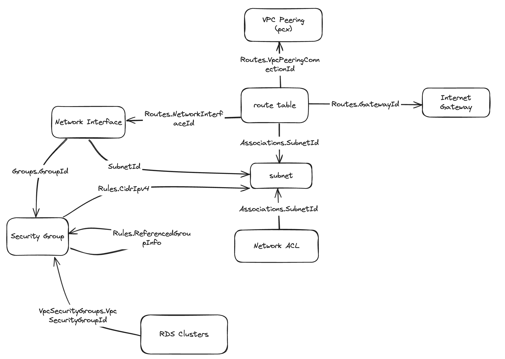

2# aws_resources_mapper

Snapshot all AWS Resources for terraform

## Requirements

- Ruby version >= `ruby 2.6.10`
- `aws-cli` installed, and all Required (AWS IAM) permissions to describe resources

## How to use

1. Install by running the command `bundler install --path .vendor/bundle`.
2. Execute the mapping with the command `bundle exec rake 'network:report[vpc-123456789]'` where `vpc-123456789` is your VPC ID
3. Execute the command `bundle exec rake 'network:network_map_graph[vpc-123456789]'` where `vpc-123456789` is your VPC ID, to generate a json file for Network Graph Visualization.

## How it works

Based on the resources association below, all resources are describe within a VPC 

